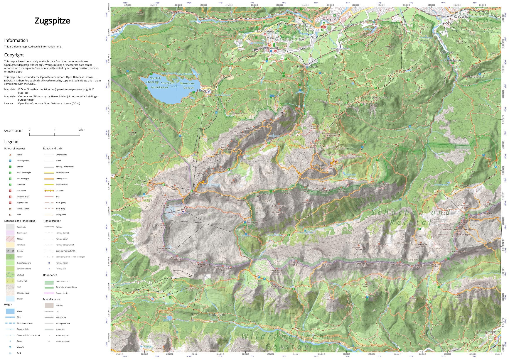

# OSM Outdoor Map

A [QGIS](https://www.qgis.org/) map style for an OSM-based outdoor map focussed on hiking and trekking.
This map is a QGIS project based on OSM data turned into a GeoPackage file.

See [this](https://hauke-stieler.de/public/maps/zugspitze/) (Zugspitze Germany/Austria) and [this](https://hauke-stieler.de/public/maps/zugspitze/) (Fischbeker Heide near Hamburg, Germany) online demos for examples of the current map style.

Or take a look at this example of a printable map:

## How to use it

Simply follow the [local setup](#local-setup) steps below to prepare OSM and elevation data.
After opening the project in QGIS, you can use the given print layout or work with the map in whatever way you like.

## Local setup

Basic steps:

1. Create a GeoPackage file `./data/data.gpkg` containing all data to show
2. Configure and start the `serve.sh` script to access MapTiler elevation data
3. Open QGIS project and work on the map

### 0. Prerequisites

First of all:
This whole setup is **Linux-based**.

Software that needs to be installed. These are the CLI commands that need to be available:

To generate and edit the style:

* `qgis` with the "Trackable QGIS Project"-plugin (to make `.qgs` files a bit mot git-friendly)
* `osmium`
* `go` (golang; version >1.12, best use the version according to the `go.mod` file)

### 1. Download data

1. Execute `import-data.sh <region>` script (requires `osmium`) with the region name as parameter. The available regions are all listed at the bottom of the script.

* This script downloads the data and crops it to the extent of the given region.
* This script also creates the required `data/data.gpkg` file for QGIS.

### 2. Start tile proxy

This project uses MapTiler as source for elevation data.
Of course, you can use whatever service or data you want (s. below), this step just describes the current setup.

#### Default: Configure to use MapTiler

The QGIS project already uses MapTiler via a local tile-proxy.
So we just need to configure this proxy and we're ready to go.

In order to now run into quota limits of MapTiler (or any other service), this project contains a small tile proxy in `tool/tile-proxy`.
This is how you start it:

1. Create an `.env` file next to the `serve.sh` script
2. Add your MapTiler API-Key there by adding the following line: `MAP_TILER_API_KEY=.....`
3. Adjust the `serve.sh` if you want to access other services
4. Run the `service.sh` script

#### Alternative: Custom elevation data

One alternative to the above MapTiler approach, is the usage of your own data.
Take a look at [HILLSHADE_CONTOURS.md](HILLSHADE_CONTOURS.md) for a tutorial on how to create your own good-looking hillshading and contour lines from GeoTIFF images using QGIS and GDAL.

### 3. Open QGIS project

1. Simply open the `map.qgs` file and work on the map.
2. Go into Settings → Options → System and add the `./sprites` folder to the list of SVG paths.

You are now ready to use the map.

## Create printable PDF

1. Create a new QGIS print layout or use the default one in this project.
2. Adjust the virtual layers (within the "legend" map theme) so that your legend contains all wanted items in correct groups.
   * Some styles on virtual layers are different from those on the actual rendered layers. So be careful when updating the legend styles.
3. Adjust the theme and create the PDF (or whatever output you want).

## Style guide

### General considerations

* **Hiking infrastructure has a higher precedence over non-hiking infrastructure.**
  * Example: Drinking water POIs are more important than some other POIs, advanced trails have a bright yellow background and generally all hiking trails are directly recognizable.
* **Hiking relevant data only.**
  * Things, that are not related or important for hikers (or other outdoor enthusiasts) are probably irrelevant. This includes for example parking spaces. Yes, people arrive by car but why should a map for hiking include parking if you use your phone or car navigation to find a parking spot?
* **Use as few different colors amd font-styles as possible.**
  * Sometimes, adjustments of font or icon colors are needed for better visualization, but keep that to a minimum.
* **Sprites should be of high quality.**
  * Whenever possible, use SVGs. If you use raster graphics, use PNGs of high quality (e.g. [rock.png](sprites/rock.png) and keep the original image editor file (`*.xcf` in case of GIMP).
* **Be inspired by the [2014 material design color palette](https://material.io/design/color/the-color-system.html#tools-for-picking-colors).**
  * These colors often work quite well, but I do change color-parameters over time to make the map even more beautiful.

More guidelines might be added over time.

### Concrete guides

This is an (incomplete) list of concrete style and design principles I use:

* Outlines
  * Many things have outlines (e.g. labels, lines, some icons, etc.)
  * Style: White, 0.5mm, 50% opacity
* Font
  * Font: Open Sans 
  * Font sizes:
    * Normal (e.g. contour labels, street/trail names): 6pt
    * Important (e.g. forest or railway station name): 8pt
    * Very important (e.g. city name): 10pt
    * Exceptions (e.g. for nature reserve areas) are allowed
* Labels:
  * Generally: White outline as described above
  * Trail and street names:
    * On line
    * Curved
* Road:
  * 0.5mm outline of light gray (#9E9E9E)
